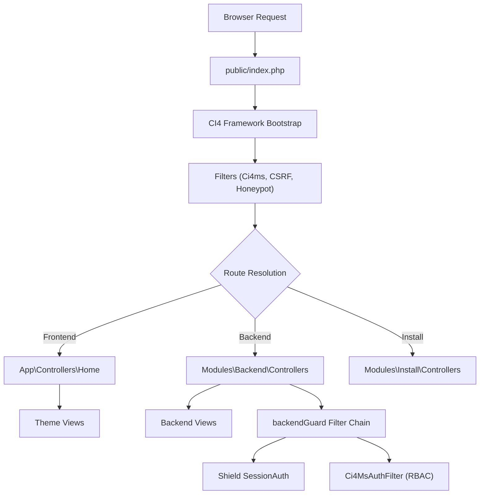
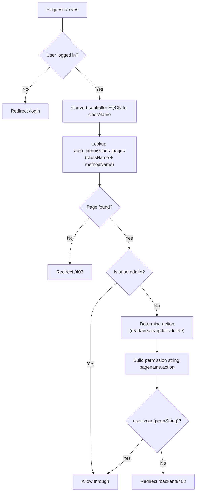
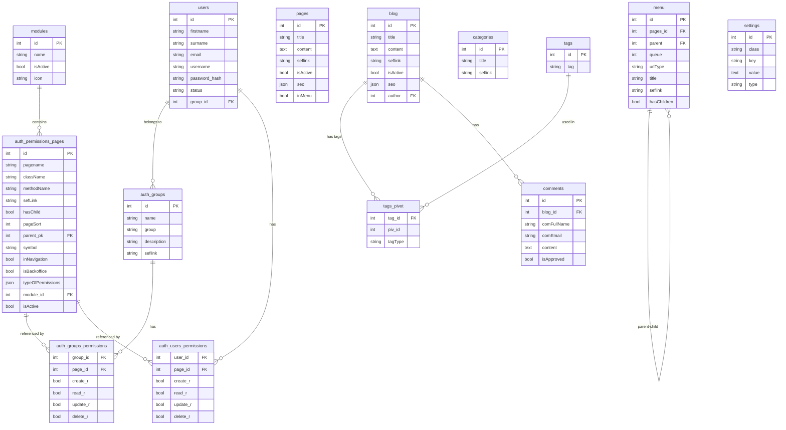

# CI4MS — Complete Codebase Walkthrough

> **Objective**: Deeply understand every component, method, and pattern in CI4MS so you can confidently maintain, extend, and improve the system.

---

## 1. High-Level Architecture

CI4MS is a modular CMS/ERP built on **CodeIgniter 4**. Its architecture follows a hub-and-spoke model:



### Key Principles

| Principle             | Implementation                                                                                          |
| --------------------- | ------------------------------------------------------------------------------------------------------- |
| **Modular**           | Each feature lives in `modules/<Name>/` with its own Controllers, Config, Models, Views, Language files |
| **Permission-driven** | Every backend route maps to an `auth_permissions_pages` row; CRUD actions are checked per-request       |
| **Cache-first**       | Settings, menus, sidebar, and page permissions are cached aggressively                                  |
| **Theme-able**        | Front-end views are resolved from `public/templates/<active>/`                                          |
| **Multi-language**    | 11 locales supported; each module has `Language/<locale>/<Module>.php` files                            |

---

## 2. Request Lifecycle

### 2.1 Front-End Request

1. **`Ci4ms` filter** (`before`): Checks `.env` exists → redirects to `/install` if missing; checks `maintenanceMode` setting → shows maintenance page if active
2. **CSRF + Honeypot** filters run globally
3. **Route resolution**: Dynamic routes loaded from each module's `Config/Routes.php` + active theme's routes
4. **`Home` controller**: Fetches page/blog from DB via `CommonModel`, runs `parseInTextFunctions()` for inline shortcodes, sets up SEO + Schema.org JSON-LD, renders theme view
5. **`Ci4ms` filter** (`after`): Caches menu data if not already cached
6. **`seofilter` + `aifilter`** (`after`): Process SEO meta tags and AI-related headers

### 2.2 Backend Request

1. **`backendGuard` filter** runs — this is an alias for TWO filters chained: `session` (Shield auth) + `Ci4MsAuthFilter`
2. **`Ci4MsAuthFilter`**:
   - Checks `auth()->loggedIn()` → redirect to `/login` if not
   - Converts controller FQCN to `className` format: `\Modules\Users\Controllers\UserController` → `-Modules-Users-Controllers-UserController`
   - Looks up `auth_permissions_pages` where `className` + `methodName` match (result cached for 1 hour)
   - **Superadmin**: Always allowed if page exists in DB
   - **Others**: Determines needed action (`read`/`create`/`update`/`delete`) from HTTP method + method name pattern, builds permission string like `Users.userList.read`, checks via `$user->can($permissionString)`
3. **Backend BaseController `initController()`**: Loads `CommonModel`, `BackendConfig`, `Encrypter`, builds `$defData` with auth config, logged-in user, navigation sidebar, page title, settings, URI info
4. **Module controller** handles the request

---

## 3. App Core Files

### 3.1 [Routes.php](app/Config/Routes.php)

- **Settings preload**: Loads settings from file cache to populate `App.templateInfos`, `App.siteName`, etc.
- **Dynamic module routes**: Scans `modules/*/Config/Routes.php` and includes each
- **Theme routes**: Includes `public/templates/<active>/Config/Routes.php` if it exists
- **Front-end routes**: `blog/(:num)`, `blog/(:any)`, `tag/(:any)`, `category/(:any)`, `newComment`, `search`, `robots.txt`, `sitemap.xml`, AI endpoints, RSS feed, and a catch-all `(:any)` for pages

### 3.2 [Filters.php](app/Config/Filters.php)

- **Dynamic filter discovery**: `loadDynamicFilters()` scans module and theme directories for filter classes
- **CSRF exception merging**: Each module's `Config/<Module>Config.php` can define `$csrfExcept` array; these get merged into the global CSRF exceptions
- **Filter chain merging**: Module configs can define `$filters` to attach filters to specific route patterns
- **`backendGuard`** alias resolves to `['session', 'Ci4MsAuthFilter']`

### 3.3 [Autoload.php](app/Config/Autoload.php)

- Registers `App\\` namespace for `app/` directory
- Dynamically discovers `modules/*/` directories and registers each as `Modules\<Name>\\`
- Core helpers auto-loaded: `text`, `filesystem`, `html`, `auth`, `setting`, `form`

### 3.4 [BaseController.php](app/Controllers/BaseController.php) (App-level)

- Initializes `CommonModel` (from `ci4commonmodel` vendor package)
- Builds `$defData` with: settings, menus (from cache), user agent, SEO service
- Used by `Home` controller (front-end)

### 3.5 [Home.php](app/Controllers/Home.php) — Front-End Controller

Key methods:

| Method                          | Purpose                                                           |
| ------------------------------- | ----------------------------------------------------------------- |
| `index($seflink)`               | Renders any page by seflink; sets up breadcrumbs, SEO, Schema.org |
| `blogList($page)`               | Paginated blog listing                                            |
| `blogDetail($seflink)`          | Single blog post with tags, categories, related posts, author     |
| `tagList($seflink, $page)`      | Blog posts filtered by tag                                        |
| `categoryList($seflink, $page)` | Blog posts filtered by category                                   |
| `newComment()`                  | Comment submission with CAPTCHA validation + bad word filtering   |

**Content shortcode system**: `parseInTextFunctions()` in `CommonLibrary` finds patterns like `{\\Namespace\\Class|method/}` in page content and replaces them with the output of calling that class method.

### 3.6 [CommonLibrary.php](app/Libraries/CommonLibrary.php)

- **`parseInTextFunctions()`**: Regex-based shortcode engine for inline template rendering
- **`get_breadcrumbs()`**: Generates breadcrumb arrays for pages, blogs, categories, tags
- **`commentBadwordFiltering()`**: Checks comment text against configurable bad word list

### 3.7 [Common.php](app/Common.php) — Global Helpers

| Function                      | Purpose                                                            |
| ----------------------------- | ------------------------------------------------------------------ |
| `seflink($str, $options)`     | URL-friendly slug generator with Turkish character transliteration |
| `menu($kategori, $parent)`    | Recursive HTML nav menu renderer from DB menu tree                 |
| `clearFilter($data)`          | Sanitizes input arrays (XSS protection via `htmlspecialchars`)     |
| `show_404()` / `show_403()`   | Custom error views                                                 |
| `compressAndOverwriteImage()` | Image optimization (resize + WebP conversion)                      |
| `hasFilesInFolder($dir)`      | Checks if directory has any files                                  |

---

## 4. Module System Architecture

Each module in `modules/<Name>/` follows a consistent structure:

```
modules/<Name>/
├── Config/
│   ├── Routes.php          # Module-specific routes
│   └── <Name>Config.php    # csrfExcept, filters, views, etc.
├── Controllers/
│   └── <Name>.php          # Extends Backend\BaseController
├── Models/                  # (optional)
├── Libraries/               # (optional)
├── Filters/                 # (optional)
├── Helpers/                 # (optional)
├── Language/
│   ├── en/<Name>.php
│   ├── tr/<Name>.php
│   └── ... (11 locales)
├── Views/
│   └── *.php
└── Database/
    └── Migrations/          # (optional)
```

---

## 5. Auth Module

**Path**: [modules/Auth/](modules/Auth)

### 5.1 [LoginController.php](modules/Auth/Controllers/LoginController.php)

- Uses **Gregwar/Captcha** library with custom styling (green background, dark text, no lines)
- Captcha phrase stored in session flashdata
- **In development mode**, captcha validation is bypassed (`if (ENVIRONMENT === 'development') $captchaCheck = true`)
- Login credentials extracted from `setting('Auth.validFields')`
- Supports "remember me" via Shield's `$authenticator->remember($remember)`
- After login, checks for pending 2FA actions (`hasAction()`)

### 5.2 [ActionController.php](modules/Auth/Controllers/ActionController.php)

- Generic handler for Shield's Authentication Actions (email verification, 2FA)
- Uses `_remap()` to intercept and validate action existence before delegating

### 5.3 [Ci4MsAuthFilter.php](modules/Auth/Filters/Ci4MsAuthFilter.php) — The Heart of RBAC



**Action determination logic** (lines 60-68):

- `GET` → `read`
- `POST` + method name contains `create` → `create`
- `POST` + method name contains `update` → `update`
- `POST` + method name contains `delete` → `delete`
- `POST` + other → `update` (default)

### 5.4 [AuthConfig.php](modules/Auth/Config/AuthConfig.php)

- CSRF exceptions: `backend/users/blackList`, `backend/users/removeFromBlackList`, `backend/users/forceResetPassword`
- Rate limiting filter: `auth-rates` applied to `login*`, `register`, `auth/*`

---

## 6. Backend Module

**Path**: [modules/Backend/](modules/Backend)

### 6.1 [BaseController.php](modules/Backend/Controllers/BaseController.php) — Backend Base

Every backend module controller extends this. It:

- Uses `ResponseTrait` for JSON API responses
- Loads `BackendConfig`, `CommonModel`, `Encrypter`
- Builds `$defData` with: auth config, logged-in user, sidebar navigation, page title, URI, settings, encrypter, template list
- **`generateSidebar()`**: Queries `auth_permissions_pages` for `inNavigation=1`, filters by user permissions (superadmin sees all, others see only permitted pages), caches for 24 hours. (Note: Sidebar items and icons are increasingly auto-configured via each module's `Config` parameters).
- **`CommonBackendLibrary`**: Exported globally for backend controllers to handle shared logic like DataTables pagination parsing and SEO data handling.

### 6.2 [AJAX.php](modules/Backend/Controllers/AJAX.php) — Shared AJAX Endpoints

| Method               | Purpose                                                               |
| -------------------- | --------------------------------------------------------------------- |
| `limitTags_ajax()`   | Tagify widget autocomplete — returns tags filtered by type/pivot      |
| `autoLookSeflinks()` | Seflink collision detection — appends `-1`, `-2`, etc. if slug exists |
| `isActive()`         | Generic toggle (any table) — used for boolean switches                |
| `maintenance()`      | Toggles maintenance mode in settings + clears settings cache          |

### 6.3 [BackendConfig.php](modules/Backend/Config/BackendConfig.php)

- Defines error views (403, 404) and base layout
- CSRF exceptions for AJAX endpoints: `tagify`, `checkSeflink`, `isActive`, `maintenance`, `summary_render`
- Attaches `backendGuard` filter to core backend routes

### 6.4 [ci4ms_helper.php](modules/Backend/Helpers/ci4ms_helper.php)

- **`nestable()`**: Renders drag-and-drop nestable HTML for menu management (recursive)
- **`format_number()`**: Formats numbers to 2 decimal places

---

## 7. Users Module

**Path**: [modules/Users/](modules/Users)

### 7.1 [UserController.php](modules/Users/Controllers/UserController.php)

| Method                              | Purpose                                                                                                                                   |
| ----------------------------------- | ----------------------------------------------------------------------------------------------------------------------------------------- |
| `users()`                           | DataTables server-side processing; excludes superadmins; shows groups, actions (update, blacklist, reset password, special perms, delete) |
| `create_user()`                     | Creates user with hashed password, sends activation email |
| `update_user($id)`                  | **⚠️ Note**: Contains `dd()` debug call on line 172 — appears to be WIP                                                                   |
| `user_del($id)`                     | Soft delete (sets `deleted_at` + status to `deleted`)                                                                                     |
| `profile()`                         | Self-service profile update; if email changes, sends re-activation email                                                                  |
| `ajax_blackList_post()`             | Bans user: creates `black_list_users` record, sets status to `banned`                                                                     |
| `ajax_remove_from_blackList_post()` | Unbans: removes from blacklist, resets password, sends activation email                                                                   |
| `ajax_force_reset_password()`       | Admin-initiated password reset with expiry; sends reset email                                                                             |

### 7.2 [PermgroupController.php](modules/Users/Controllers/PermgroupController.php)

| Method              | Purpose                                                                                                           |
| ------------------- | ----------------------------------------------------------------------------------------------------------------- |
| `groupList()`       | DataTables listing of permission groups                                                                           |
| `group_create()`    | Creates group in `auth_groups`, inserts CRUD permissions per page in `auth_groups_permissions`                    |
| `group_update($id)` | Updates group, **delete-and-recreate** pattern for permissions, invalidates permission cache for all group users  |
| `user_perms($id)`   | Per-user permission overrides (stored in `auth_users_permissions`), shows comparison with group-level permissions |

**Permission data flow**:

```
auth_permissions_pages (defines pages/methods)
         ↓
auth_groups_permissions (group → page → CRUD flags)
         ↓
auth_users_permissions (user-specific overrides)
```

---

## 8. Methods Module — Route/Permission Auto-Discovery

**Path**: [modules/Methods/](modules/Methods)

### 8.1 [Methods.php](modules/Methods/Controllers/Methods.php)

**`moduleScan()`** is the most sophisticated method in the system. It inspects routes to align them with permission records and auto-configures sidebar menus and icons from module Config parameters:

1. Loads all defined routes from the route collection
2. For each route, checks if `backendGuard` is in the filter chain
3. Extracts module name and method name via regex from the handler string
4. Reads `role` from route options (set in route definitions like `'role' => 'read,create,update,delete'`)
5. Deduplicates by handler name
6. Compares scanned routes against existing `auth_permissions_pages` entries
7. **Auto-creates** new entries for any discovered routes not yet in the DB
8. Auto-creates `modules` records for newly discovered modules

This is how CI4MS auto-discovers new routes when you add a new module — you just run the module scan from the backend UI.

**`index()`** also handles toggling module/page active status via AJAX.

---

## 9. Blog Module

**Path**: [modules/Blog/](modules/Blog)

### 9.1 [Blog.php](modules/Blog/Controllers/Blog.php)

| Method                | Purpose                                                                                                                                                                        |
| --------------------- | ------------------------------------------------------------------------------------------------------------------------------------------------------------------------------ |
| `index()`             | Blog list with DataTables (server-side)                                                                                                                                        |
| `new()`               | Create blog with: title, seflink, content (rich editor), active/draft, categories (pivot table), author, cover image + SEO metadata, tags via `CommonTagsLibrary::checkTags()` |
| `edit($id)`           | Update blog; handles seflink collision check, tag updates, category pivot re-creation                                                                                          |
| `delete($id)`         | Deletes blog post + associated tag pivots                                                                                                                                      |
| `commentList()`       | Comment management view                                                                                                                                                        |
| `commentResponse()`   | DataTables AJAX for comments, filterable by approval status                                                                                                                    |
| `commentRemove($id)`  | Delete comment                                                                                                                                                                 |
| `displayComment($id)` | View single comment with associated blog info                                                                                                                                  |
| `confirmComment($id)` | Approve (option=1) or reject/delete (option=2) comment                                                                                                                         |
| `badwordList()`       | Display bad word filter settings                                                                                                                                               |
| `badwordsAdd()`       | Save bad word list, status, autoReject, autoAccept flags                                                                                                                       |

### 9.2 Tag System

Tags use a **pivot table** (`tags_pivot`) with columns: `tag_id`, `piv_id` (blog/page ID), `tagType` (e.g., `'blogs'`). The `CommonTagsLibrary::checkTags()` method handles creating new tags, associating existing ones, and cleaning up on updates.

### 9.3 Category System

Categories use `blog_categories_pivot` table linking `blog_id` → `categories_id`. Categories themselves are managed by the separate `Categories` controller.

---

## 10. Pages Module

**Path**: [modules/Pages/](modules/Pages)

### 10.1 [Pages.php](modules/Pages/Controllers/Pages.php)

Standard CRUD with DataTables. Notable:

- SEO data stored as JSON in `seo` column: `coverImage`, `IMGWidth`, `IMGHeight`, `description`, `keywords`
- Seflink uniqueness checked against `categories` table (not just `pages`) to prevent URL collisions
- Uses `CommonTagsLibrary` for keyword/tag handling

---

## 11. Menu Module

**Path**: [modules/Menu/](modules/Menu)

### 11.1 [Menu.php](modules/Menu/Controllers/Menu.php)

Manages the front-end navigation menu with drag-and-drop reordering:

| Method              | Purpose                                                                             |
| ------------------- | ----------------------------------------------------------------------------------- |
| `index()`           | Shows menu builder with available pages and blogs                                   |
| `create()`          | Adds single page/blog/URL to menu with auto-queue positioning                       |
| `addMultipleMenu()` | Batch-add multiple pages/blogs to menu                                              |
| `delete_ajax()`     | Removes menu item; re-parents children, updates `hasChildren` flags                 |
| `queue_ajax()`      | Saves drag-and-drop reordering; recursive `queue()` method handles nested hierarchy |
| `listURLs()`        | Returns available pages/blogs for the menu builder                                  |

**Menu data model**: `menu` table with `pages_id`, `parent` (self-referential FK), `queue` (sort order), `urlType` (`pages`/`blogs`/`url`), `title`, `seflink`, `target`, `hasChildren`. When items are reordered, the `queue()` method recursively updates queue + parent for all items, then clears the `menus` cache.

---

## 12. Settings Module

**Path**: [modules/Settings/](modules/Settings)

### 12.1 [Settings.php](modules/Settings/Controllers/Settings.php)

| Section                | Method                                           | Key Details                                                                                                                                                                                  |
| ---------------------- | ------------------------------------------------ | -------------------------------------------------------------------------------------------------------------------------------------------------------------------------------------------- |
| **Company Info**       | `compInfosPost()`                                | Uses CI4's `setting()` service to store `App.siteName`, `App.contact` (JSON), `App.slogan`, `App.logo`, `Gmap.map_iframe`                                                                    |
| **Social Media**       | `socialMediaPost()`                              | Validates URL format + string names; stores as JSON array in `App.socialNetwork`                                                                                                             |
| **Mail Settings**      | `mailSettingsPost()`                             | **Password encryption**: `base64_encode($encrypter->encrypt($password))` before saving; stores in `App.mail` as JSON                                                                         |
| **Test Mail**          | `testMail()`                                     | AJAX endpoint to send a test email |
| **Template Selection** | `templateSelectPost()`                           | AJAX — sets active template path/name in `App.templateInfos`                                                                                                                                 |
| **Template Settings**  | `templateSettings()` / `templateSettings_post()` | Theme-specific settings view loaded from the template directory; merges settings into `App.templateInfos`                                                                                    |
| **Allowed Files**      | `saveAllowedFiles()`                             | Configures allowed file upload extensions in `Security.allowedFiles`                                                                                                                         |
| **elFinder WebP**      | `elfinderConvertWebp()`                          | AJAX toggle for auto WebP conversion in media manager                                                                                                                                        |

All settings methods clear the `settings` cache after saving.

---

## 13. Install Module

**Path**: [modules/Install/](modules/Install)

### 13.1 [Install.php](modules/Install/Controllers/Install.php)

**Installation flow**:

1. User fills form with: base URL, DB credentials, admin user details, site name
2. `copyEnvFile()` copies `env` → `.env`
3. `updateEnvSettings()` writes all config values to `.env` (regex-based key=value replacement)
4. `generateEncryptionKey()` creates `hex2bin:` prefixed random key
5. Redirects to `/install/dbsetup` with user data in query params
6. `dbsetup()`:
   - Runs `$migrate->latest()` to create all database tables
   - Calls `InstallService::createDefaultData()` to seed the database
   - Regenerates `Routes.php` from template
   - Creates `writable/backups/`, `public/uploads/.tmb`, `public/uploads/.trash` directories

### 13.2 [InstallService.php](modules/Install/Services/InstallService.php)

Seeds all essential data:

| Data                       | Details                                                                                                                                     |
| -------------------------- | ------------------------------------------------------------------------------------------------------------------------------------------- |
| **auth_groups**            | Creates `superadmin` group (id=1)                                                                                                           |
| **users**                  | Creates admin user with hashed password                                                                                                     |
| **modules**                | 12 default modules: Backend, Blog, Fileeditor, Media, Menu, Methods, ModulesInstaller, Pages, Settings, Theme, Users, Logs                  |
| **auth_permissions_pages** | **84 permission entries** mapping every backend route to its controller, method, CRUD flags, navigation settings                            |
| **pages**                  | 3 default pages: Hakkımızda (About), İletişim (Contact), Anasayfa (Home)                                                                    |
| **menu**                   | 4 default menu items                                                                                                                        |
| **settings**               | 10 default settings: template info, site name, logo, social networks, contact, mail config, Google Maps, security, slogan, maintenance mode |

---

## 14. Other Modules (Summary)

### 14.1 Media Module

- Wraps **elFinder** file manager for media uploads
- `elfinderConnection()` handles the connector endpoint
- Configurable allowed file types via Settings
- Optional auto-WebP conversion

### 14.2 Fileeditor Module

- In-browser file/folder manager for the template directory
- CRUD operations: list, read, save, rename, create file/folder, move, delete
- Each operation has its own permission entry

### 14.3 Theme Module

- Lists available themes from `public/templates/`
- Upload new themes (ZIP extraction)
- Template selection handled via Settings module

### 14.4 ModulesInstaller Module

- Upload new modules as ZIP files
- Extracts to `modules/` directory
- After upload, use Methods `moduleScan` to register routes/permissions

### 14.5 Logs Module

- Integrates with **ci4-log-viewer** vendor package
- Displays CI4 log files in the backend
- Read-only access

### 14.6 Locked Module (Backend)

- Shows brute-force lockout records
- DataTables listing with search
- Supports GET and POST for viewing/managing locked accounts

---

## 15. Database Schema (Key Tables)



---

## 16. Caching Strategy

| Cache Key              | TTL        | Purpose                 | Cleared By                              |
| ---------------------- | ---------- | ----------------------- | --------------------------------------- |
| `settings`             | File cache | All system settings     | Any settings update                     |
| `menus`                | File cache | Front-end navigation    | Menu reorder operation                  |
| `sidebar_menu`         | 24 hours   | Backend sidebar items   | Not auto-cleared (requires cache clear) |
| `backend_page_info_*`  | 1 hour     | Permission page lookups | Not auto-cleared                        |
| `{userId}_permissions` | Runtime    | User permission strings | Permission group/user update            |

---

## 17. Key Design Patterns

### 17.1 DataTables Server-Side Pattern

Almost every listing in the backend follows this pattern:

```php
public function index() {
    if ($this->request->is('post') && $this->request->isAJAX()) {
        $data = clearFilter($this->request->getPost());
        $like = $data['search']['value'];
        // ... query with CommonModel->lists()
        // ... format results (add action buttons as HTML strings)
        return $this->respond(['draw'=>..., 'iTotalRecords'=>..., 'aaData'=>...]);
    }
    return view('Module\Views\list', $this->defData);
}
```

### 17.2 Create/Update Pattern

```php
public function create() {
    if ($this->request->is('post')) {
        // 1. Define validation rules
        // 2. Validate → redirect back with errors if fail
        // 3. Check uniqueness (seflink, email, etc.)
        // 4. Build data array
        // 5. CommonModel->create() or ->edit()
        // 6. Handle related entities (tags, categories, pivots)
        // 7. Redirect with success/error message
    }
    // Load form data and return view
}
```

### 17.3 AJAX Safety Pattern

```php
if (!$this->request->isAJAX()) return $this->failForbidden();
// validate → process → respond as JSON
```

### 17.4 Settings Storage Pattern

Settings use CI4's `setting()` service which stores to the `settings` DB table. Complex values (objects/arrays) are `json_encode()`'d before storage and `json_decode()`'d on retrieval. Sensitive data (SMTP passwords) are encrypted before JSON encoding.

---

## 18. Vendor Dependencies

| Package               | Purpose                                                                                                                                             |
| --------------------- | --------------------------------------------------------------------------------------------------------------------------------------------------- |
| `ci4commonmodel`      | Generic database operations (`lists`, `selectOne`, `create`, `edit`, `remove`, `isHave`, `count`) — avoids writing individual models for each table |
| `codeigniter4/shield` | Authentication (session-based), user provider, groups, permissions                                                                                  |
| `ci4-seo`             | SEO meta tag generation, Schema.org markup                                                                                                          |
| `ci4-module`          | Module generator CLI tools                                                                                                                          |
| `gregwar/captcha`     | Visual CAPTCHA generation for login/comments                                                                                                        |
| `intervention/image`  | Image manipulation (resize, compress, WebP)                                                                                                         |
| `ci4-log-viewer`      | Log file viewer in backend                                                                                                                          |
| `studio-42/elfinder`  | Web-based file manager for media uploads                                                                                                            |

---

## 19. CLI Commands

| Command        | File                                                                                                      | Purpose                                                                       |
| -------------- | --------------------------------------------------------------------------------------------------------- | ----------------------------------------------------------------------------- |
| `create:route` | [GenerateRoute.php](app/Commands/GenerateRoute.php) | Regenerates `Routes.php` from template                                        |
| `make:abview`  | [Adminview.php](app/Commands/Adminview.php)         | Generates backend view files using `Ci4msTrait`                               |
| `Ci4msTrait`   | [Ci4msTrait.php](app/Commands/Ci4msTrait.php)       | Common generator logic: namespace resolution, path building, template parsing |

---

## 20. Important Notes & Gotchas

> [!NOTE]
> **CSRF exceptions** are scattered across module configs. When adding a new AJAX endpoint, remember to add it to the module's `Config/<Module>Config.php` `$csrfExcept` array, OR include the CSRF token in the AJAX request headers.

> [!TIP]
> **Adding a new module**: Create the module directory structure → add routes with `backendGuard` filter and `'role'` option → run `moduleScan` from the backend Methods page → assign permissions to groups.

> [!IMPORTANT]
> **Cache clearing**: After changing settings, permissions, or menus, the corresponding cache MUST be cleared. Most methods do this automatically, but the `sidebar_menu` cache (24h TTL) may need a manual clear or server restart to reflect new permission pages.
